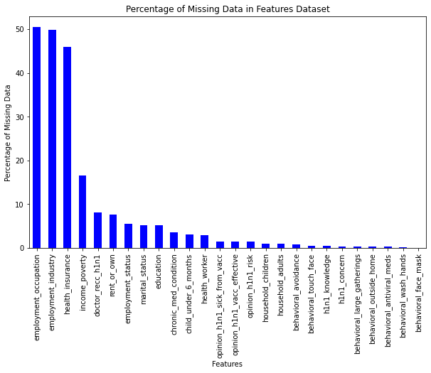
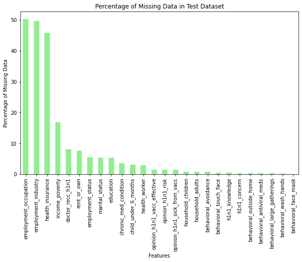
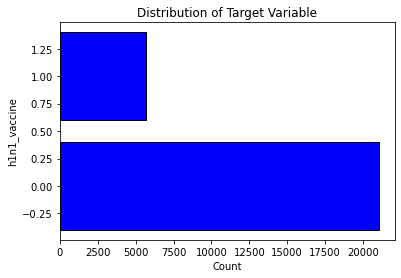
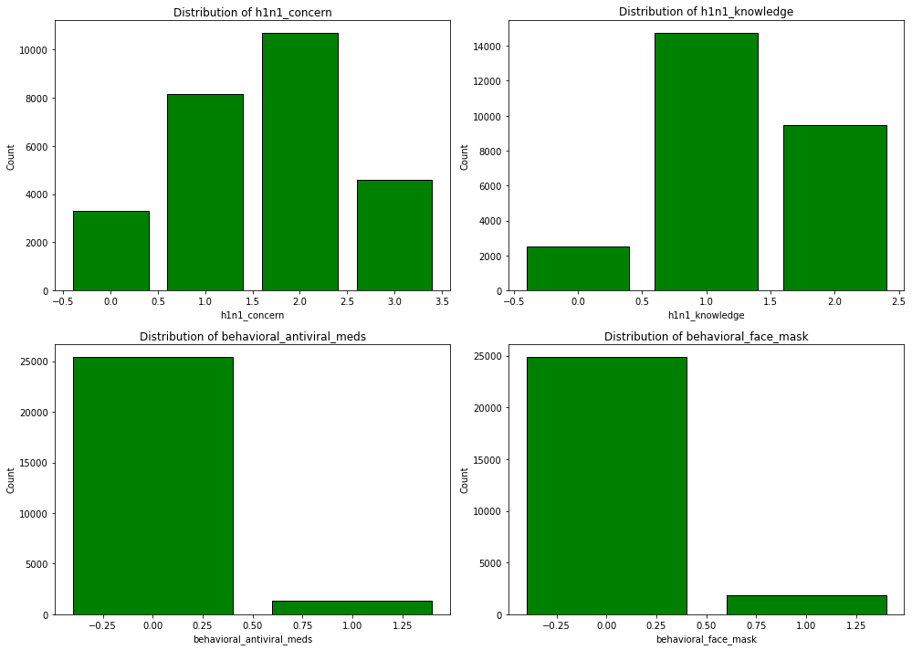
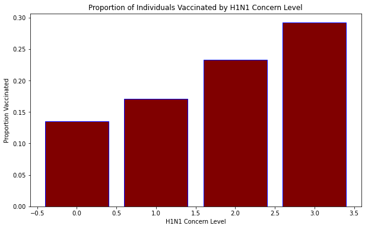
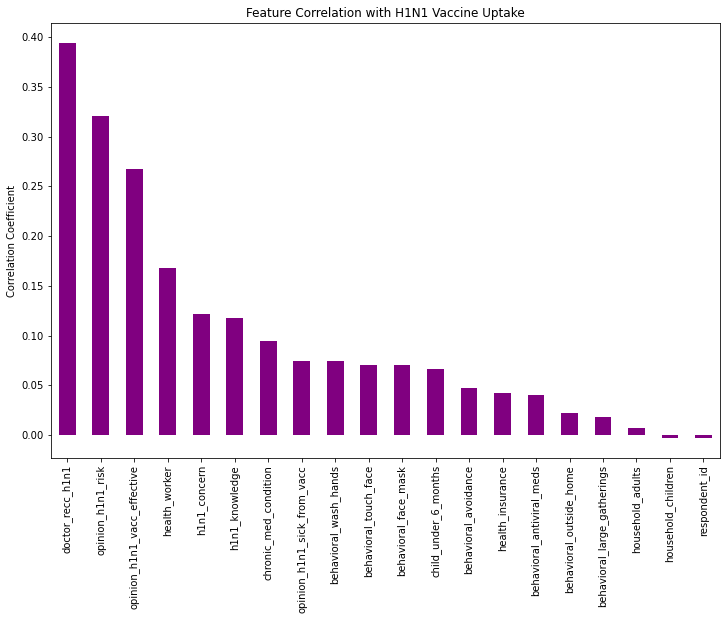
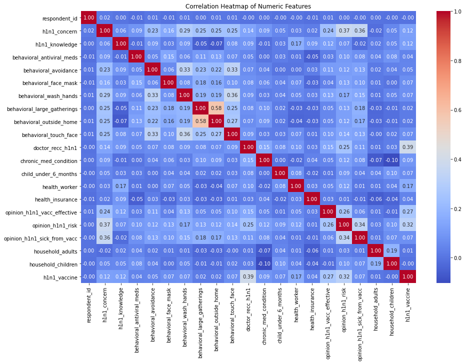

# **Predicting H1N1 Vaccine Uptake: Insights for Future Public Health Strategies**

## **Business Understanding**

The constant struggle against the infectious diseases such as H1N1 influenza pandemic in 2009 has also contributed to the understanding of the role of the vaccination in the public health measures. Understanding how individuals respond to vaccines can help shape future health initiatives and improve vaccination rates. By accurately predicting individuals' likelihood of receiving the H1N1 vaccine, this project aims to provide valuable insights to public health organizations, policymakers, and healthcare providers.So, by creating a model, the organizations of public health, lawmakers, and health care providers will be able to identify factors that affect the decision to vaccinate. These insights may help in the design of specific public health campaigns and the most effective distribution of vaccines, and therefore ultimately lessen the transmission of infectious diseases through improved herd immunity. The outcomes of this project can suggest further research avenues and contribute to the creation of measures that would increase the public’s confidence in vaccination and ensure the effective control of present and future epidemics.


## Objectives

- Identify key factors that influence individuals' decisions to receive the H1N1 vaccine.
- Build a predictive model to forecast public response to newly introduced vaccines based on demographic and behavioral data.
- Provide actionable insights to public health organizations for developing targeted vaccination campaigns and strategies.
- Enhance preparedness for future pandemics by understanding vaccine acceptance and hesitancy patterns.

## **Data Understanding**

The dataset used in this project is derived from the National 2009 H1N1 Flu Survey conducted by the United States National Center for Health Statistics. This survey collected responses from individuals across the United States regarding their vaccination status against the H1N1 flu virus and the seasonal flu, alongside various demographic, behavioral, and opinion-based factors. The dataset provides a rich source of information to understand the factors influencing vaccination decisions, making it highly suitable for this project.

### Data Source and Suitability

The data comes from a reputable source, the U.S. Department of Health and Human Services (DHHS), specifically the National Center for Health Statistics (NCHS). The dataset includes responses from thousands of individuals, capturing a broad spectrum of the population. It is suitable for the project as it includes both the target variables (whether individuals received the H1N1 and seasonal flu vaccines) and numerous potential predictors, such as:

- Demographic information (e.g., age, sex, race, education, income)
- Health behaviors (e.g., hand washing, mask-wearing, social distancing)
- Health status (e.g., presence of chronic medical conditions, being a health worker)
- Opinions and concerns about the effectiveness and risks associated with the vaccines.

These features provide comprehensive insights into the factors that may influence an individual's decision to get vaccinated, allowing us to build a predictive model with practical applicability.

### Dataset Size and Descriptive Statistics

The dataset consists of several thousand rows, each representing a unique respondent. There are 36 columns in the dataset, including the respondent ID, two target variables (h1n1_vaccine and seasonal_vaccine), and 34 features.

Let's load the dataset and explore its size and some basic descriptive statistics for all features.


Importing the necessary libaries. 


```python
##import necessary libraries
import numpy as np
import pandas as pd
from matplotlib import pyplot as plt
import seaborn as sns
%matplotlib inline

import warnings
warnings.filterwarnings('ignore')

#sklearn preprocessing
from sklearn.preprocessing import StandardScaler, LabelEncoder
from sklearn.preprocessing import MinMaxScaler
from sklearn.linear_model import Lasso, Ridge, LinearRegression
from sklearn.metrics import mean_squared_error

# sklearn classification models
from sklearn.linear_model import LogisticRegression
from sklearn.tree import DecisionTreeClassifier
from sklearn.neighbors import KNeighborsClassifier
from sklearn.ensemble import RandomForestClassifier

#sklearn evaluation metrics and validation
from sklearn.model_selection import train_test_split, cross_val_score, GridSearchCV
from sklearn.metrics import accuracy_score, recall_score, precision_score, f1_score
```

Loading Features Data


```python
# Loading and viewing the first 5 rows of feature data
features_df = pd.read_csv("training_set_features.csv")
features_df.head()
```


<div>
<style scoped>
    .dataframe tbody tr th:only-of-type {
        vertical-align: middle;
    }

    .dataframe tbody tr th {
        vertical-align: top;
    }

    .dataframe thead th {
        text-align: right;
    }
</style>
<table border="1" class="dataframe">
  <thead>
    <tr style="text-align: right;">
      <th></th>
      <th>respondent_id</th>
      <th>h1n1_concern</th>
      <th>h1n1_knowledge</th>
      <th>behavioral_antiviral_meds</th>
      <th>behavioral_avoidance</th>
      <th>behavioral_face_mask</th>
      <th>behavioral_wash_hands</th>
      <th>behavioral_large_gatherings</th>
      <th>behavioral_outside_home</th>
      <th>behavioral_touch_face</th>
      <th>...</th>
      <th>income_poverty</th>
      <th>marital_status</th>
      <th>rent_or_own</th>
      <th>employment_status</th>
      <th>hhs_geo_region</th>
      <th>census_msa</th>
      <th>household_adults</th>
      <th>household_children</th>
      <th>employment_industry</th>
      <th>employment_occupation</th>
    </tr>
  </thead>
  <tbody>
    <tr>
      <th>0</th>
      <td>0</td>
      <td>1.0</td>
      <td>0.0</td>
      <td>0.0</td>
      <td>0.0</td>
      <td>0.0</td>
      <td>0.0</td>
      <td>0.0</td>
      <td>1.0</td>
      <td>1.0</td>
      <td>...</td>
      <td>Below Poverty</td>
      <td>Not Married</td>
      <td>Own</td>
      <td>Not in Labor Force</td>
      <td>oxchjgsf</td>
      <td>Non-MSA</td>
      <td>0.0</td>
      <td>0.0</td>
      <td>NaN</td>
      <td>NaN</td>
    </tr>
    <tr>
      <th>1</th>
      <td>1</td>
      <td>3.0</td>
      <td>2.0</td>
      <td>0.0</td>
      <td>1.0</td>
      <td>0.0</td>
      <td>1.0</td>
      <td>0.0</td>
      <td>1.0</td>
      <td>1.0</td>
      <td>...</td>
      <td>Below Poverty</td>
      <td>Not Married</td>
      <td>Rent</td>
      <td>Employed</td>
      <td>bhuqouqj</td>
      <td>MSA, Not Principle  City</td>
      <td>0.0</td>
      <td>0.0</td>
      <td>pxcmvdjn</td>
      <td>xgwztkwe</td>
    </tr>
    <tr>
      <th>2</th>
      <td>2</td>
      <td>1.0</td>
      <td>1.0</td>
      <td>0.0</td>
      <td>1.0</td>
      <td>0.0</td>
      <td>0.0</td>
      <td>0.0</td>
      <td>0.0</td>
      <td>0.0</td>
      <td>...</td>
      <td>&lt;= $75,000, Above Poverty</td>
      <td>Not Married</td>
      <td>Own</td>
      <td>Employed</td>
      <td>qufhixun</td>
      <td>MSA, Not Principle  City</td>
      <td>2.0</td>
      <td>0.0</td>
      <td>rucpziij</td>
      <td>xtkaffoo</td>
    </tr>
    <tr>
      <th>3</th>
      <td>3</td>
      <td>1.0</td>
      <td>1.0</td>
      <td>0.0</td>
      <td>1.0</td>
      <td>0.0</td>
      <td>1.0</td>
      <td>1.0</td>
      <td>0.0</td>
      <td>0.0</td>
      <td>...</td>
      <td>Below Poverty</td>
      <td>Not Married</td>
      <td>Rent</td>
      <td>Not in Labor Force</td>
      <td>lrircsnp</td>
      <td>MSA, Principle City</td>
      <td>0.0</td>
      <td>0.0</td>
      <td>NaN</td>
      <td>NaN</td>
    </tr>
    <tr>
      <th>4</th>
      <td>4</td>
      <td>2.0</td>
      <td>1.0</td>
      <td>0.0</td>
      <td>1.0</td>
      <td>0.0</td>
      <td>1.0</td>
      <td>1.0</td>
      <td>0.0</td>
      <td>1.0</td>
      <td>...</td>
      <td>&lt;= $75,000, Above Poverty</td>
      <td>Married</td>
      <td>Own</td>
      <td>Employed</td>
      <td>qufhixun</td>
      <td>MSA, Not Principle  City</td>
      <td>1.0</td>
      <td>0.0</td>
      <td>wxleyezf</td>
      <td>emcorrxb</td>
    </tr>
  </tbody>
</table>
<p>5 rows × 36 columns</p>
</div>


```python
# Check the shape of the features dataset
print(f"Features dataset shape: {features_df.shape}")
```

    Features dataset shape: (26707, 36)
    

The features dataset contains 26707 observations and 36 features. 


```python
# Check basic information for the features dataset
print("Features dataset info:")
print(features_df.info())
```

    Features dataset info:
    <class 'pandas.core.frame.DataFrame'>
    RangeIndex: 26707 entries, 0 to 26706
    Data columns (total 36 columns):
     #   Column                       Non-Null Count  Dtype  
    ---  ------                       --------------  -----  
     0   respondent_id                26707 non-null  int64  
     1   h1n1_concern                 26615 non-null  float64
     2   h1n1_knowledge               26591 non-null  float64
     3   behavioral_antiviral_meds    26636 non-null  float64
     4   behavioral_avoidance         26499 non-null  float64
     5   behavioral_face_mask         26688 non-null  float64
     6   behavioral_wash_hands        26665 non-null  float64
     7   behavioral_large_gatherings  26620 non-null  float64
     8   behavioral_outside_home      26625 non-null  float64
     9   behavioral_touch_face        26579 non-null  float64
     10  doctor_recc_h1n1             24547 non-null  float64
     11  doctor_recc_seasonal         24547 non-null  float64
     12  chronic_med_condition        25736 non-null  float64
     13  child_under_6_months         25887 non-null  float64
     14  health_worker                25903 non-null  float64
     15  health_insurance             14433 non-null  float64
     16  opinion_h1n1_vacc_effective  26316 non-null  float64
     17  opinion_h1n1_risk            26319 non-null  float64
     18  opinion_h1n1_sick_from_vacc  26312 non-null  float64
     19  opinion_seas_vacc_effective  26245 non-null  float64
     20  opinion_seas_risk            26193 non-null  float64
     21  opinion_seas_sick_from_vacc  26170 non-null  float64
     22  age_group                    26707 non-null  object 
     23  education                    25300 non-null  object 
     24  race                         26707 non-null  object 
     25  sex                          26707 non-null  object 
     26  income_poverty               22284 non-null  object 
     27  marital_status               25299 non-null  object 
     28  rent_or_own                  24665 non-null  object 
     29  employment_status            25244 non-null  object 
     30  hhs_geo_region               26707 non-null  object 
     31  census_msa                   26707 non-null  object 
     32  household_adults             26458 non-null  float64
     33  household_children           26458 non-null  float64
     34  employment_industry          13377 non-null  object 
     35  employment_occupation        13237 non-null  object 
    dtypes: float64(23), int64(1), object(12)
    memory usage: 7.3+ MB
    None
    

The features dataset contains a combination of  integers, floatsand object data types. 

Loading Test Data...


```python
# previewing the test dataframe
test_df = pd.read_csv("test_set_features.csv")
test_df.head()
```


<div>
<style scoped>
    .dataframe tbody tr th:only-of-type {
        vertical-align: middle;
    }

    .dataframe tbody tr th {
        vertical-align: top;
    }

    .dataframe thead th {
        text-align: right;
    }
</style>
<table border="1" class="dataframe">
  <thead>
    <tr style="text-align: right;">
      <th></th>
      <th>respondent_id</th>
      <th>h1n1_concern</th>
      <th>h1n1_knowledge</th>
      <th>behavioral_antiviral_meds</th>
      <th>behavioral_avoidance</th>
      <th>behavioral_face_mask</th>
      <th>behavioral_wash_hands</th>
      <th>behavioral_large_gatherings</th>
      <th>behavioral_outside_home</th>
      <th>behavioral_touch_face</th>
      <th>...</th>
      <th>income_poverty</th>
      <th>marital_status</th>
      <th>rent_or_own</th>
      <th>employment_status</th>
      <th>hhs_geo_region</th>
      <th>census_msa</th>
      <th>household_adults</th>
      <th>household_children</th>
      <th>employment_industry</th>
      <th>employment_occupation</th>
    </tr>
  </thead>
  <tbody>
    <tr>
      <th>0</th>
      <td>26707</td>
      <td>2.0</td>
      <td>2.0</td>
      <td>0.0</td>
      <td>1.0</td>
      <td>0.0</td>
      <td>1.0</td>
      <td>1.0</td>
      <td>0.0</td>
      <td>1.0</td>
      <td>...</td>
      <td>&gt; $75,000</td>
      <td>Not Married</td>
      <td>Rent</td>
      <td>Employed</td>
      <td>mlyzmhmf</td>
      <td>MSA, Not Principle  City</td>
      <td>1.0</td>
      <td>0.0</td>
      <td>atmlpfrs</td>
      <td>hfxkjkmi</td>
    </tr>
    <tr>
      <th>1</th>
      <td>26708</td>
      <td>1.0</td>
      <td>1.0</td>
      <td>0.0</td>
      <td>0.0</td>
      <td>0.0</td>
      <td>0.0</td>
      <td>0.0</td>
      <td>0.0</td>
      <td>0.0</td>
      <td>...</td>
      <td>Below Poverty</td>
      <td>Not Married</td>
      <td>Rent</td>
      <td>Employed</td>
      <td>bhuqouqj</td>
      <td>Non-MSA</td>
      <td>3.0</td>
      <td>0.0</td>
      <td>atmlpfrs</td>
      <td>xqwwgdyp</td>
    </tr>
    <tr>
      <th>2</th>
      <td>26709</td>
      <td>2.0</td>
      <td>2.0</td>
      <td>0.0</td>
      <td>0.0</td>
      <td>1.0</td>
      <td>1.0</td>
      <td>1.0</td>
      <td>1.0</td>
      <td>1.0</td>
      <td>...</td>
      <td>&gt; $75,000</td>
      <td>Married</td>
      <td>Own</td>
      <td>Employed</td>
      <td>lrircsnp</td>
      <td>Non-MSA</td>
      <td>1.0</td>
      <td>0.0</td>
      <td>nduyfdeo</td>
      <td>pvmttkik</td>
    </tr>
    <tr>
      <th>3</th>
      <td>26710</td>
      <td>1.0</td>
      <td>1.0</td>
      <td>0.0</td>
      <td>0.0</td>
      <td>0.0</td>
      <td>0.0</td>
      <td>0.0</td>
      <td>0.0</td>
      <td>0.0</td>
      <td>...</td>
      <td>&lt;= $75,000, Above Poverty</td>
      <td>Married</td>
      <td>Own</td>
      <td>Not in Labor Force</td>
      <td>lrircsnp</td>
      <td>MSA, Not Principle  City</td>
      <td>1.0</td>
      <td>0.0</td>
      <td>NaN</td>
      <td>NaN</td>
    </tr>
    <tr>
      <th>4</th>
      <td>26711</td>
      <td>3.0</td>
      <td>1.0</td>
      <td>1.0</td>
      <td>1.0</td>
      <td>0.0</td>
      <td>1.0</td>
      <td>1.0</td>
      <td>1.0</td>
      <td>1.0</td>
      <td>...</td>
      <td>&lt;= $75,000, Above Poverty</td>
      <td>Not Married</td>
      <td>Own</td>
      <td>Employed</td>
      <td>lzgpxyit</td>
      <td>Non-MSA</td>
      <td>0.0</td>
      <td>1.0</td>
      <td>fcxhlnwr</td>
      <td>mxkfnird</td>
    </tr>
  </tbody>
</table>
<p>5 rows × 36 columns</p>
</div>


```python
# Checking the shape of the labels dataset
print(f"Labels dataset shape: {test_df.shape}")
```

    Labels dataset shape: (26708, 36)
    

The test dataset contains 26708 observations and 36 features. 


```python
# Check basic information for the features dataset
print("Features dataset info:")
print(features_df.info())
```

    Features dataset info:
    <class 'pandas.core.frame.DataFrame'>
    RangeIndex: 26707 entries, 0 to 26706
    Data columns (total 36 columns):
     #   Column                       Non-Null Count  Dtype  
    ---  ------                       --------------  -----  
     0   respondent_id                26707 non-null  int64  
     1   h1n1_concern                 26615 non-null  float64
     2   h1n1_knowledge               26591 non-null  float64
     3   behavioral_antiviral_meds    26636 non-null  float64
     4   behavioral_avoidance         26499 non-null  float64
     5   behavioral_face_mask         26688 non-null  float64
     6   behavioral_wash_hands        26665 non-null  float64
     7   behavioral_large_gatherings  26620 non-null  float64
     8   behavioral_outside_home      26625 non-null  float64
     9   behavioral_touch_face        26579 non-null  float64
     10  doctor_recc_h1n1             24547 non-null  float64
     11  doctor_recc_seasonal         24547 non-null  float64
     12  chronic_med_condition        25736 non-null  float64
     13  child_under_6_months         25887 non-null  float64
     14  health_worker                25903 non-null  float64
     15  health_insurance             14433 non-null  float64
     16  opinion_h1n1_vacc_effective  26316 non-null  float64
     17  opinion_h1n1_risk            26319 non-null  float64
     18  opinion_h1n1_sick_from_vacc  26312 non-null  float64
     19  opinion_seas_vacc_effective  26245 non-null  float64
     20  opinion_seas_risk            26193 non-null  float64
     21  opinion_seas_sick_from_vacc  26170 non-null  float64
     22  age_group                    26707 non-null  object 
     23  education                    25300 non-null  object 
     24  race                         26707 non-null  object 
     25  sex                          26707 non-null  object 
     26  income_poverty               22284 non-null  object 
     27  marital_status               25299 non-null  object 
     28  rent_or_own                  24665 non-null  object 
     29  employment_status            25244 non-null  object 
     30  hhs_geo_region               26707 non-null  object 
     31  census_msa                   26707 non-null  object 
     32  household_adults             26458 non-null  float64
     33  household_children           26458 non-null  float64
     34  employment_industry          13377 non-null  object 
     35  employment_occupation        13237 non-null  object 
    dtypes: float64(23), int64(1), object(12)
    memory usage: 7.3+ MB
    None
    

Similar to features dataset, test data contains a combination of  integers, floats and object data types. 

Loading labels dataset...


```python
# Loading the labels dataset
labels_df = pd.read_csv('training_set_labels.csv')
labels_df.head()
```


<div>
<style scoped>
    .dataframe tbody tr th:only-of-type {
        vertical-align: middle;
    }

    .dataframe tbody tr th {
        vertical-align: top;
    }

    .dataframe thead th {
        text-align: right;
    }
</style>
<table border="1" class="dataframe">
  <thead>
    <tr style="text-align: right;">
      <th></th>
      <th>respondent_id</th>
      <th>h1n1_vaccine</th>
      <th>seasonal_vaccine</th>
    </tr>
  </thead>
  <tbody>
    <tr>
      <th>0</th>
      <td>0</td>
      <td>0</td>
      <td>0</td>
    </tr>
    <tr>
      <th>1</th>
      <td>1</td>
      <td>0</td>
      <td>1</td>
    </tr>
    <tr>
      <th>2</th>
      <td>2</td>
      <td>0</td>
      <td>0</td>
    </tr>
    <tr>
      <th>3</th>
      <td>3</td>
      <td>0</td>
      <td>1</td>
    </tr>
    <tr>
      <th>4</th>
      <td>4</td>
      <td>0</td>
      <td>0</td>
    </tr>
  </tbody>
</table>
</div>


```python
# Checking the shape of the labels dataset
print(f"Labels dataset shape: {labels_df.shape}")
```

    Labels dataset shape: (26707, 3)
    

The labels dataframe contains 26707 observations and 3 columns.


```python
# Checking basic information for the labels dataset
print("\nLabels dataset info:")
print(labels_df.info())
```

    
    Labels dataset info:
    <class 'pandas.core.frame.DataFrame'>
    RangeIndex: 26707 entries, 0 to 26706
    Data columns (total 3 columns):
     #   Column            Non-Null Count  Dtype
    ---  ------            --------------  -----
     0   respondent_id     26707 non-null  int64
     1   h1n1_vaccine      26707 non-null  int64
     2   seasonal_vaccine  26707 non-null  int64
    dtypes: int64(3)
    memory usage: 626.1 KB
    None
    

The columns have consistent and appropriate data types (integers)

Since the project focuses on predicting whether individuals received the H1N1 vaccine, we can refine the datasets to target this specific variable. The `labels_df` dataset contains both `h1n1_vaccine` and `seasonal_vaccine` as target variables. However, since we are only interested in predicting the `h1n1_vaccine` uptake, we will drop the `seasonal_vaccine` column from `labels_df`.


```python
# Drop the 'seasonal_vaccine' column from labels_df
labels_h1n1_df = labels_df.drop(columns=['seasonal_vaccine'])
```


```python
# Display the first few rows to confirm the changes
print(labels_h1n1_df.head())
```

       respondent_id  h1n1_vaccine
    0              0             0
    1              1             0
    2              2             0
    3              3             0
    4              4             0
    

Additionally, the `features_df` and `test_df` datasets contains features related to both H1N1 and seasonal flu. To maintain the focus solely on predicting the response to the H1N1 vaccine, I will remove features specifically related to the seasonal flu vaccine from the `features_df` and `test_df`. These features include `doctor_recc_seasonal`, `opinion_seas_vacc_effective`, `opinion_seas_risk`, and `opinion_seas_sick_from_vacc`. By doing this, I ensure that my model is trained on relevant information, enhancing its predictive capability for the H1N1 vaccine.


```python
# List of seasonal flu-related features to drop
seasonal_features_to_drop = [
    'doctor_recc_seasonal',
    'opinion_seas_vacc_effective',
    'opinion_seas_risk',
    'opinion_seas_sick_from_vacc'
]

# Drop seasonal flu-related features from features_df
features_h1n1_df = features_df.drop(columns=seasonal_features_to_drop)

# Display the first few rows to confirm the changes
print(features_h1n1_df.head())

```

       respondent_id  h1n1_concern  h1n1_knowledge  behavioral_antiviral_meds  \
    0              0           1.0             0.0                        0.0   
    1              1           3.0             2.0                        0.0   
    2              2           1.0             1.0                        0.0   
    3              3           1.0             1.0                        0.0   
    4              4           2.0             1.0                        0.0   
    
       behavioral_avoidance  behavioral_face_mask  behavioral_wash_hands  \
    0                   0.0                   0.0                    0.0   
    1                   1.0                   0.0                    1.0   
    2                   1.0                   0.0                    0.0   
    3                   1.0                   0.0                    1.0   
    4                   1.0                   0.0                    1.0   
    
       behavioral_large_gatherings  behavioral_outside_home  \
    0                          0.0                      1.0   
    1                          0.0                      1.0   
    2                          0.0                      0.0   
    3                          1.0                      0.0   
    4                          1.0                      0.0   
    
       behavioral_touch_face  ...             income_poverty  marital_status  \
    0                    1.0  ...              Below Poverty     Not Married   
    1                    1.0  ...              Below Poverty     Not Married   
    2                    0.0  ...  <= $75,000, Above Poverty     Not Married   
    3                    0.0  ...              Below Poverty     Not Married   
    4                    1.0  ...  <= $75,000, Above Poverty         Married   
    
       rent_or_own   employment_status  hhs_geo_region                census_msa  \
    0          Own  Not in Labor Force        oxchjgsf                   Non-MSA   
    1         Rent            Employed        bhuqouqj  MSA, Not Principle  City   
    2          Own            Employed        qufhixun  MSA, Not Principle  City   
    3         Rent  Not in Labor Force        lrircsnp       MSA, Principle City   
    4          Own            Employed        qufhixun  MSA, Not Principle  City   
    
       household_adults  household_children employment_industry  \
    0               0.0                 0.0                 NaN   
    1               0.0                 0.0            pxcmvdjn   
    2               2.0                 0.0            rucpziij   
    3               0.0                 0.0                 NaN   
    4               1.0                 0.0            wxleyezf   
    
      employment_occupation  
    0                   NaN  
    1              xgwztkwe  
    2              xtkaffoo  
    3                   NaN  
    4              emcorrxb  
    
    [5 rows x 32 columns]
    


```python
# List of seasonal flu-related features to drop (same as before)
seasonal_features_to_drop = [
    'doctor_recc_seasonal',
    'opinion_seas_vacc_effective',
    'opinion_seas_risk',
    'opinion_seas_sick_from_vacc'
]

# Drop seasonal flu-related features from test_df
test_h1n1_df = test_df.drop(columns=seasonal_features_to_drop)

# Display the first few rows to confirm the changes
print(test_h1n1_df.head())

```

       respondent_id  h1n1_concern  h1n1_knowledge  behavioral_antiviral_meds  \
    0          26707           2.0             2.0                        0.0   
    1          26708           1.0             1.0                        0.0   
    2          26709           2.0             2.0                        0.0   
    3          26710           1.0             1.0                        0.0   
    4          26711           3.0             1.0                        1.0   
    
       behavioral_avoidance  behavioral_face_mask  behavioral_wash_hands  \
    0                   1.0                   0.0                    1.0   
    1                   0.0                   0.0                    0.0   
    2                   0.0                   1.0                    1.0   
    3                   0.0                   0.0                    0.0   
    4                   1.0                   0.0                    1.0   
    
       behavioral_large_gatherings  behavioral_outside_home  \
    0                          1.0                      0.0   
    1                          0.0                      0.0   
    2                          1.0                      1.0   
    3                          0.0                      0.0   
    4                          1.0                      1.0   
    
       behavioral_touch_face  ...             income_poverty  marital_status  \
    0                    1.0  ...                  > $75,000     Not Married   
    1                    0.0  ...              Below Poverty     Not Married   
    2                    1.0  ...                  > $75,000         Married   
    3                    0.0  ...  <= $75,000, Above Poverty         Married   
    4                    1.0  ...  <= $75,000, Above Poverty     Not Married   
    
       rent_or_own   employment_status  hhs_geo_region                census_msa  \
    0         Rent            Employed        mlyzmhmf  MSA, Not Principle  City   
    1         Rent            Employed        bhuqouqj                   Non-MSA   
    2          Own            Employed        lrircsnp                   Non-MSA   
    3          Own  Not in Labor Force        lrircsnp  MSA, Not Principle  City   
    4          Own            Employed        lzgpxyit                   Non-MSA   
    
       household_adults  household_children employment_industry  \
    0               1.0                 0.0            atmlpfrs   
    1               3.0                 0.0            atmlpfrs   
    2               1.0                 0.0            nduyfdeo   
    3               1.0                 0.0                 NaN   
    4               0.0                 1.0            fcxhlnwr   
    
      employment_occupation  
    0              hfxkjkmi  
    1              xqwwgdyp  
    2              pvmttkik  
    3                   NaN  
    4              mxkfnird  
    
    [5 rows x 32 columns]
    

By performing these operations, I streamline the datasets to focus on the H1N1 vaccine, ensuring that my model is not confused by irrelevant information about the seasonal flu vaccine. This will likely improve model performance since it reduces noise and concentrates on the specific factors influencing H1N1 vaccination uptake. The refined datasets (`labels_h1n1_df` and `features_h1n1_df`) will now be used for further data preprocessing, model building, and evaluation.

##### Dataframe Description


```python
# features dataframe Description
features_h1n1_df.describe()
```


<div>
<style scoped>
    .dataframe tbody tr th:only-of-type {
        vertical-align: middle;
    }

    .dataframe tbody tr th {
        vertical-align: top;
    }

    .dataframe thead th {
        text-align: right;
    }
</style>
<table border="1" class="dataframe">
  <thead>
    <tr style="text-align: right;">
      <th></th>
      <th>respondent_id</th>
      <th>h1n1_concern</th>
      <th>h1n1_knowledge</th>
      <th>behavioral_antiviral_meds</th>
      <th>behavioral_avoidance</th>
      <th>behavioral_face_mask</th>
      <th>behavioral_wash_hands</th>
      <th>behavioral_large_gatherings</th>
      <th>behavioral_outside_home</th>
      <th>behavioral_touch_face</th>
      <th>doctor_recc_h1n1</th>
      <th>chronic_med_condition</th>
      <th>child_under_6_months</th>
      <th>health_worker</th>
      <th>health_insurance</th>
      <th>opinion_h1n1_vacc_effective</th>
      <th>opinion_h1n1_risk</th>
      <th>opinion_h1n1_sick_from_vacc</th>
      <th>household_adults</th>
      <th>household_children</th>
    </tr>
  </thead>
  <tbody>
    <tr>
      <th>count</th>
      <td>26707.000000</td>
      <td>26615.000000</td>
      <td>26591.000000</td>
      <td>26636.000000</td>
      <td>26499.000000</td>
      <td>26688.000000</td>
      <td>26665.000000</td>
      <td>26620.00000</td>
      <td>26625.000000</td>
      <td>26579.000000</td>
      <td>24547.000000</td>
      <td>25736.000000</td>
      <td>25887.000000</td>
      <td>25903.000000</td>
      <td>14433.00000</td>
      <td>26316.000000</td>
      <td>26319.000000</td>
      <td>26312.000000</td>
      <td>26458.000000</td>
      <td>26458.000000</td>
    </tr>
    <tr>
      <th>mean</th>
      <td>13353.000000</td>
      <td>1.618486</td>
      <td>1.262532</td>
      <td>0.048844</td>
      <td>0.725612</td>
      <td>0.068982</td>
      <td>0.825614</td>
      <td>0.35864</td>
      <td>0.337315</td>
      <td>0.677264</td>
      <td>0.220312</td>
      <td>0.283261</td>
      <td>0.082590</td>
      <td>0.111918</td>
      <td>0.87972</td>
      <td>3.850623</td>
      <td>2.342566</td>
      <td>2.357670</td>
      <td>0.886499</td>
      <td>0.534583</td>
    </tr>
    <tr>
      <th>std</th>
      <td>7709.791156</td>
      <td>0.910311</td>
      <td>0.618149</td>
      <td>0.215545</td>
      <td>0.446214</td>
      <td>0.253429</td>
      <td>0.379448</td>
      <td>0.47961</td>
      <td>0.472802</td>
      <td>0.467531</td>
      <td>0.414466</td>
      <td>0.450591</td>
      <td>0.275266</td>
      <td>0.315271</td>
      <td>0.32530</td>
      <td>1.007436</td>
      <td>1.285539</td>
      <td>1.362766</td>
      <td>0.753422</td>
      <td>0.928173</td>
    </tr>
    <tr>
      <th>min</th>
      <td>0.000000</td>
      <td>0.000000</td>
      <td>0.000000</td>
      <td>0.000000</td>
      <td>0.000000</td>
      <td>0.000000</td>
      <td>0.000000</td>
      <td>0.00000</td>
      <td>0.000000</td>
      <td>0.000000</td>
      <td>0.000000</td>
      <td>0.000000</td>
      <td>0.000000</td>
      <td>0.000000</td>
      <td>0.00000</td>
      <td>1.000000</td>
      <td>1.000000</td>
      <td>1.000000</td>
      <td>0.000000</td>
      <td>0.000000</td>
    </tr>
    <tr>
      <th>25%</th>
      <td>6676.500000</td>
      <td>1.000000</td>
      <td>1.000000</td>
      <td>0.000000</td>
      <td>0.000000</td>
      <td>0.000000</td>
      <td>1.000000</td>
      <td>0.00000</td>
      <td>0.000000</td>
      <td>0.000000</td>
      <td>0.000000</td>
      <td>0.000000</td>
      <td>0.000000</td>
      <td>0.000000</td>
      <td>1.00000</td>
      <td>3.000000</td>
      <td>1.000000</td>
      <td>1.000000</td>
      <td>0.000000</td>
      <td>0.000000</td>
    </tr>
    <tr>
      <th>50%</th>
      <td>13353.000000</td>
      <td>2.000000</td>
      <td>1.000000</td>
      <td>0.000000</td>
      <td>1.000000</td>
      <td>0.000000</td>
      <td>1.000000</td>
      <td>0.00000</td>
      <td>0.000000</td>
      <td>1.000000</td>
      <td>0.000000</td>
      <td>0.000000</td>
      <td>0.000000</td>
      <td>0.000000</td>
      <td>1.00000</td>
      <td>4.000000</td>
      <td>2.000000</td>
      <td>2.000000</td>
      <td>1.000000</td>
      <td>0.000000</td>
    </tr>
    <tr>
      <th>75%</th>
      <td>20029.500000</td>
      <td>2.000000</td>
      <td>2.000000</td>
      <td>0.000000</td>
      <td>1.000000</td>
      <td>0.000000</td>
      <td>1.000000</td>
      <td>1.00000</td>
      <td>1.000000</td>
      <td>1.000000</td>
      <td>0.000000</td>
      <td>1.000000</td>
      <td>0.000000</td>
      <td>0.000000</td>
      <td>1.00000</td>
      <td>5.000000</td>
      <td>4.000000</td>
      <td>4.000000</td>
      <td>1.000000</td>
      <td>1.000000</td>
    </tr>
    <tr>
      <th>max</th>
      <td>26706.000000</td>
      <td>3.000000</td>
      <td>2.000000</td>
      <td>1.000000</td>
      <td>1.000000</td>
      <td>1.000000</td>
      <td>1.000000</td>
      <td>1.00000</td>
      <td>1.000000</td>
      <td>1.000000</td>
      <td>1.000000</td>
      <td>1.000000</td>
      <td>1.000000</td>
      <td>1.000000</td>
      <td>1.00000</td>
      <td>5.000000</td>
      <td>5.000000</td>
      <td>5.000000</td>
      <td>3.000000</td>
      <td>3.000000</td>
    </tr>
  </tbody>
</table>
</div>


```python
# Labels data Description
labels_h1n1_df.describe()
```


<div>
<style scoped>
    .dataframe tbody tr th:only-of-type {
        vertical-align: middle;
    }

    .dataframe tbody tr th {
        vertical-align: top;
    }

    .dataframe thead th {
        text-align: right;
    }
</style>
<table border="1" class="dataframe">
  <thead>
    <tr style="text-align: right;">
      <th></th>
      <th>respondent_id</th>
      <th>h1n1_vaccine</th>
    </tr>
  </thead>
  <tbody>
    <tr>
      <th>count</th>
      <td>26707.000000</td>
      <td>26707.000000</td>
    </tr>
    <tr>
      <th>mean</th>
      <td>13353.000000</td>
      <td>0.212454</td>
    </tr>
    <tr>
      <th>std</th>
      <td>7709.791156</td>
      <td>0.409052</td>
    </tr>
    <tr>
      <th>min</th>
      <td>0.000000</td>
      <td>0.000000</td>
    </tr>
    <tr>
      <th>25%</th>
      <td>6676.500000</td>
      <td>0.000000</td>
    </tr>
    <tr>
      <th>50%</th>
      <td>13353.000000</td>
      <td>0.000000</td>
    </tr>
    <tr>
      <th>75%</th>
      <td>20029.500000</td>
      <td>0.000000</td>
    </tr>
    <tr>
      <th>max</th>
      <td>26706.000000</td>
      <td>1.000000</td>
    </tr>
  </tbody>
</table>
</div>


```python
# # Labels data Description
test_h1n1_df.describe()
```


<div>
<style scoped>
    .dataframe tbody tr th:only-of-type {
        vertical-align: middle;
    }

    .dataframe tbody tr th {
        vertical-align: top;
    }

    .dataframe thead th {
        text-align: right;
    }
</style>
<table border="1" class="dataframe">
  <thead>
    <tr style="text-align: right;">
      <th></th>
      <th>respondent_id</th>
      <th>h1n1_concern</th>
      <th>h1n1_knowledge</th>
      <th>behavioral_antiviral_meds</th>
      <th>behavioral_avoidance</th>
      <th>behavioral_face_mask</th>
      <th>behavioral_wash_hands</th>
      <th>behavioral_large_gatherings</th>
      <th>behavioral_outside_home</th>
      <th>behavioral_touch_face</th>
      <th>doctor_recc_h1n1</th>
      <th>chronic_med_condition</th>
      <th>child_under_6_months</th>
      <th>health_worker</th>
      <th>health_insurance</th>
      <th>opinion_h1n1_vacc_effective</th>
      <th>opinion_h1n1_risk</th>
      <th>opinion_h1n1_sick_from_vacc</th>
      <th>household_adults</th>
      <th>household_children</th>
    </tr>
  </thead>
  <tbody>
    <tr>
      <th>count</th>
      <td>26708.000000</td>
      <td>26623.000000</td>
      <td>26586.000000</td>
      <td>26629.000000</td>
      <td>26495.000000</td>
      <td>26689.000000</td>
      <td>26668.000000</td>
      <td>26636.000000</td>
      <td>26626.000000</td>
      <td>26580.000000</td>
      <td>24548.000000</td>
      <td>25776.000000</td>
      <td>25895.000000</td>
      <td>25919.000000</td>
      <td>14480.000000</td>
      <td>26310.000000</td>
      <td>26328.000000</td>
      <td>26333.000000</td>
      <td>26483.000000</td>
      <td>26483.000000</td>
    </tr>
    <tr>
      <th>mean</th>
      <td>40060.500000</td>
      <td>1.623145</td>
      <td>1.266042</td>
      <td>0.049645</td>
      <td>0.729798</td>
      <td>0.069279</td>
      <td>0.826084</td>
      <td>0.351517</td>
      <td>0.337227</td>
      <td>0.683747</td>
      <td>0.222666</td>
      <td>0.281037</td>
      <td>0.086310</td>
      <td>0.111501</td>
      <td>0.887914</td>
      <td>3.844622</td>
      <td>2.326838</td>
      <td>2.360612</td>
      <td>0.894310</td>
      <td>0.543745</td>
    </tr>
    <tr>
      <th>std</th>
      <td>7710.079831</td>
      <td>0.902755</td>
      <td>0.615617</td>
      <td>0.217215</td>
      <td>0.444072</td>
      <td>0.253934</td>
      <td>0.379045</td>
      <td>0.477453</td>
      <td>0.472772</td>
      <td>0.465022</td>
      <td>0.416044</td>
      <td>0.449514</td>
      <td>0.280827</td>
      <td>0.314758</td>
      <td>0.315483</td>
      <td>1.007570</td>
      <td>1.275636</td>
      <td>1.359413</td>
      <td>0.754244</td>
      <td>0.935057</td>
    </tr>
    <tr>
      <th>min</th>
      <td>26707.000000</td>
      <td>0.000000</td>
      <td>0.000000</td>
      <td>0.000000</td>
      <td>0.000000</td>
      <td>0.000000</td>
      <td>0.000000</td>
      <td>0.000000</td>
      <td>0.000000</td>
      <td>0.000000</td>
      <td>0.000000</td>
      <td>0.000000</td>
      <td>0.000000</td>
      <td>0.000000</td>
      <td>0.000000</td>
      <td>1.000000</td>
      <td>1.000000</td>
      <td>1.000000</td>
      <td>0.000000</td>
      <td>0.000000</td>
    </tr>
    <tr>
      <th>25%</th>
      <td>33383.750000</td>
      <td>1.000000</td>
      <td>1.000000</td>
      <td>0.000000</td>
      <td>0.000000</td>
      <td>0.000000</td>
      <td>1.000000</td>
      <td>0.000000</td>
      <td>0.000000</td>
      <td>0.000000</td>
      <td>0.000000</td>
      <td>0.000000</td>
      <td>0.000000</td>
      <td>0.000000</td>
      <td>1.000000</td>
      <td>3.000000</td>
      <td>1.000000</td>
      <td>1.000000</td>
      <td>0.000000</td>
      <td>0.000000</td>
    </tr>
    <tr>
      <th>50%</th>
      <td>40060.500000</td>
      <td>2.000000</td>
      <td>1.000000</td>
      <td>0.000000</td>
      <td>1.000000</td>
      <td>0.000000</td>
      <td>1.000000</td>
      <td>0.000000</td>
      <td>0.000000</td>
      <td>1.000000</td>
      <td>0.000000</td>
      <td>0.000000</td>
      <td>0.000000</td>
      <td>0.000000</td>
      <td>1.000000</td>
      <td>4.000000</td>
      <td>2.000000</td>
      <td>2.000000</td>
      <td>1.000000</td>
      <td>0.000000</td>
    </tr>
    <tr>
      <th>75%</th>
      <td>46737.250000</td>
      <td>2.000000</td>
      <td>2.000000</td>
      <td>0.000000</td>
      <td>1.000000</td>
      <td>0.000000</td>
      <td>1.000000</td>
      <td>1.000000</td>
      <td>1.000000</td>
      <td>1.000000</td>
      <td>0.000000</td>
      <td>1.000000</td>
      <td>0.000000</td>
      <td>0.000000</td>
      <td>1.000000</td>
      <td>5.000000</td>
      <td>4.000000</td>
      <td>4.000000</td>
      <td>1.000000</td>
      <td>1.000000</td>
    </tr>
    <tr>
      <th>max</th>
      <td>53414.000000</td>
      <td>3.000000</td>
      <td>2.000000</td>
      <td>1.000000</td>
      <td>1.000000</td>
      <td>1.000000</td>
      <td>1.000000</td>
      <td>1.000000</td>
      <td>1.000000</td>
      <td>1.000000</td>
      <td>1.000000</td>
      <td>1.000000</td>
      <td>1.000000</td>
      <td>1.000000</td>
      <td>1.000000</td>
      <td>5.000000</td>
      <td>5.000000</td>
      <td>5.000000</td>
      <td>3.000000</td>
      <td>3.000000</td>
    </tr>
  </tbody>
</table>
</div>


### Data Limitations

While the dataset is comprehensive, there are some limitations:

- Missing Data: Some features have missing values, particularly those related to employment industry and occupation. This could introduce bias if not properly handled.

- Self-Reported Data: The dataset is based on self-reported information, which can be subject to biases such as underreporting or overreporting.

- Temporal Context: The data is from 2009-2010, which may not fully represent current attitudes towards vaccination, especially after the COVID-19 pandemic.

Despite these limitations, the dataset provides a robust foundation for understanding factors influencing vaccine uptake and building predictive models to inform future public health strategies.

## **Data Preparation**

This section prepares data for analysis and modeling. Proper data preparation is crucial for building a robust model. It involves cleaning the data, handling missing values, transforming variables, and ensuring the dataset is suitable for analysis.

### Handling Missing Data
Missing data can significantly affect the performance of a machine learning model. We will first identify the columns with missing values and decide on an appropriate strategy to handle them.

#### Missing values in feature data


```python
# Check for missing values in features_h1n1_df
missing_values_features = features_h1n1_df.isnull().sum()
missing_values_features = missing_values_features[missing_values_features > 0]
missing_values_features_percentage = (missing_values_features / len(features_h1n1_df)) * 100
print("Missing Values in Features Dataset:\n")
print(missing_values_features_percentage)
```

    Missing Values in Features Dataset:
    
    h1n1_concern                    0.344479
    h1n1_knowledge                  0.434343
    behavioral_antiviral_meds       0.265848
    behavioral_avoidance            0.778822
    behavioral_face_mask            0.071142
    behavioral_wash_hands           0.157262
    behavioral_large_gatherings     0.325757
    behavioral_outside_home         0.307036
    behavioral_touch_face           0.479275
    doctor_recc_h1n1                8.087767
    chronic_med_condition           3.635751
    child_under_6_months            3.070356
    health_worker                   3.010447
    health_insurance               45.957989
    opinion_h1n1_vacc_effective     1.464036
    opinion_h1n1_risk               1.452803
    opinion_h1n1_sick_from_vacc     1.479013
    education                       5.268282
    income_poverty                 16.561201
    marital_status                  5.272026
    rent_or_own                     7.645936
    employment_status               5.477965
    household_adults                0.932340
    household_children              0.932340
    employment_industry            49.912008
    employment_occupation          50.436215
    dtype: float64
    

Visualization for missing data for features data


```python

plt.figure(figsize=(10, 6))
missing_values_features_percentage.sort_values(ascending=False).plot(kind='bar', color='blue')
plt.title('Percentage of Missing Data in Features Dataset')
plt.xlabel('Features')
plt.ylabel('Percentage of Missing Data')
plt.xticks(rotation=90)
plt.show()

```





Visualization for missing data for Labels data


```python
# Check for missing values in label_h1n1_df
missing_values_labels = labels_h1n1_df.isnull().sum()
missing_values_labels = missing_values_labels[missing_values_labels > 0]
missing_values_labels_percentage = (missing_values_labels / len(labels_h1n1_df)) * 100
print("\nMissing Values in Labels Dataset:\n")
print(missing_values_labels_percentage)
```

    
    Missing Values in Labels Dataset:
    
    Series([], dtype: float64)
    

Missing Data for Lables Data


```python
# Check for missing values in label_h1n1_df
missing_values_labels = labels_h1n1_df.isnull().sum()
missing_values_labels = missing_values_labels[missing_values_labels > 0]
missing_values_labels_percentage = (missing_values_labels / len(labels_h1n1_df)) * 100
missing_values_labels_percentage
```


    Series([], dtype: float64)


Visualization for missing data for Lables data


```python
# Visualize missing data for label_h1n1_df only if there are missing values
if not missing_values_labels.empty:
    plt.figure(figsize=(10, 4))
    missing_values_labels_percentage.plot(kind='bar', color='salmon')
    plt.title('Percentage of Missing Data in Labels Dataset')
    plt.xlabel('Labels')
    plt.ylabel('Percentage of Missing Data')
    plt.xticks(rotation=90)
    plt.show()
else:
    print("No missing values in label_h1n1_df.")
```

    No missing values in label_h1n1_df.
    

Missing Data for Test Data


```python
# Check for missing values in test_h1n1_df
missing_values_test = test_h1n1_df.isnull().sum()
missing_values_test = missing_values_test[missing_values_test > 0]
missing_values_test_percentage = (missing_values_test / len(test_h1n1_df)) * 100
missing_values_test_percentage
```


    h1n1_concern                    0.318257
    h1n1_knowledge                  0.456792
    behavioral_antiviral_meds       0.295792
    behavioral_avoidance            0.797514
    behavioral_face_mask            0.071140
    behavioral_wash_hands           0.149768
    behavioral_large_gatherings     0.269582
    behavioral_outside_home         0.307024
    behavioral_touch_face           0.479257
    doctor_recc_h1n1                8.087464
    chronic_med_condition           3.489591
    child_under_6_months            3.044032
    health_worker                   2.954171
    health_insurance               45.784035
    opinion_h1n1_vacc_effective     1.490190
    opinion_h1n1_risk               1.422795
    opinion_h1n1_sick_from_vacc     1.404074
    education                       5.268084
    income_poverty                 16.837652
    marital_status                  5.399131
    rent_or_own                     7.623184
    employment_status               5.507713
    household_adults                0.842444
    household_children              0.842444
    employment_industry            49.704208
    employment_occupation          50.269582
    dtype: float64


Visualization for missing data for Lables data


```python
# Visualize missing data for test_h1n1_df using a bar graph (descending order)
plt.figure(figsize=(10, 6))
missing_values_test_percentage.sort_values(ascending=False).plot(kind='bar', color='lightgreen')
plt.title('Percentage of Missing Data in Test Dataset')
plt.xlabel('Features')
plt.ylabel('Percentage of Missing Data')
plt.xticks(rotation=90)
plt.show()
```





### Handling Missing Data

After visualizing the missing data, it is time for the decision on the best strategies to handle them. Different strategies will be applied based on the percentage of missing data and the type of data (numerical or categorical).

Explanation:

- Impute Missing Values: We'll use mean or median for numerical columns and mode for categorical columns. For columns with a high percentage of missing values, we may consider dropping them if they do not contribute significant value to the model.
- Strategy Justification: Imputing missing values helps in maintaining the dataset size and structure, which is crucial for model stability.


```python
# Handling Missing Values in features and test data

# Impute missing values for numerical columns using median
numerical_columns = features_h1n1_df.select_dtypes(include=['float64', 'int64']).columns
for column in numerical_columns:
    features_h1n1_df[column].fillna(features_h1n1_df[column].median(), inplace=True)
    test_h1n1_df[column].fillna(test_h1n1_df[column].median(), inplace=True)

# Impute missing values for categorical columns using mode
categorical_columns = features_h1n1_df.select_dtypes(include=['object']).columns
for column in categorical_columns:
    features_h1n1_df[column].fillna(features_h1n1_df[column].mode()[0], inplace=True)
    test_h1n1_df[column].fillna(test_h1n1_df[column].mode()[0], inplace=True)

# Confirm that there are no missing values left in features and test datasets
print("\nMissing Values in Features Dataset After Imputation:\n")
print(features_h1n1_df.isnull().sum().sum())

print("\nMissing Values in Test Dataset After Imputation:\n")
print(test_h1n1_df.isnull().sum().sum())
```

    
    Missing Values in Features Dataset After Imputation:
    
    0
    
    Missing Values in Test Dataset After Imputation:
    
    0
    

### Checking for Duplicate Data


```python
# Check for duplicates in features_h1n1_df
duplicates_features = features_h1n1_df.duplicated().sum()
print(f"Number of duplicate rows in features_h1n1_df: {duplicates_features}")

# Check for duplicates in label_h1n1_df
duplicates_labels = labels_h1n1_df.duplicated().sum()
print(f"Number of duplicate rows in label_h1n1_df: {duplicates_labels}")

# Check for duplicates in test_h1n1_df
duplicates_test = test_h1n1_df.duplicated().sum()
print(f"Number of duplicate rows in test_h1n1_df: {duplicates_test}")

```

    Number of duplicate rows in features_h1n1_df: 0
    Number of duplicate rows in label_h1n1_df: 0
    Number of duplicate rows in test_h1n1_df: 0
    

From the above, there is no duplicate data in all the datasets

Our Datasets are now ready for further analysis as starts from the section below:


## Exploratory Data Analysis (EDA) 

To conduct an Exploratory Data Analysis (EDA) on our datasets (features_h1n1_df, labels_h1n1_df, and test_h1n1_df), we will perform univariate and bivariate analyses, as well as correlation analysis, to understand the distribution of individual variables, relationships between pairs of variables, and the overall structure of the data. I will include visualizations for each section to make the analysis more intuitive and comprehensive.

### Univariate Analysis

In this section, I'll analyze the distribution of individual features and the target variable (`h1n1_vaccine`). This helps in understanding the spread, central tendency, and any anomalies in the data.

Distribution of Target Variable (h1n1_vaccine):


```python
# Select the target column
h1n1_vaccine = labels_h1n1_df['h1n1_vaccine']

# Get the unique values and their frequency in the target column
unique_values, counts = np.unique(h1n1_vaccine, return_counts=True)

# Create a bar plot
fig, ax = plt.subplots()
ax.barh(unique_values, counts, color='blue', edgecolor='black')

# Set the x-axis label
ax.set_xlabel('Count')

# Set the y-axis label
ax.set_ylabel('h1n1_vaccine')

# Set the title
ax.set_title('Distribution of Target Variable')

# Show the plot
plt.show()
```





The distribution plot shows that roughly only about 20% of people received the H1N1 flu vaccine. This suggests that the target variable is moderately imbalanced, which will be an important consideration when building predictive models.

Univariate Analysis of Features:

Next, I will visualize the distribution of some of the key features to understand their properties.


```python
# Visualize some key features
features_to_plot = ['h1n1_concern', 'h1n1_knowledge', 'behavioral_antiviral_meds', 'behavioral_face_mask']

fig, axes = plt.subplots(2, 2, figsize=(14, 10))

for i, feature in enumerate(features_to_plot):
    ax = axes[i // 2, i % 2]
    feature_counts = features_h1n1_df[feature].value_counts()
    ax.bar(feature_counts.index, feature_counts.values, color='green', edgecolor='black')
    ax.set_title(f'Distribution of {feature}')
    ax.set_xlabel(feature)
    ax.set_ylabel('Count')

plt.tight_layout()
plt.show()

```





### Bivariate Analysis

Bivariate analysis involves exploring relationships between pairs of variables. Here, I will analyze the relationship between individual features and the target variable.


```python
# Merge features and labels for analysis
merged_df = features_h1n1_df.copy()
merged_df['h1n1_vaccine'] = labels_h1n1_df['h1n1_vaccine']

# Plotting h1n1 vaccine proportion in relation to individuals' concern
h1n1_concern_grouped = merged_df.groupby('h1n1_concern')['h1n1_vaccine'].mean().sort_index()

plt.figure(figsize=(10, 6))
plt.bar(h1n1_concern_grouped.index, h1n1_concern_grouped.values, color='maroon', edgecolor='blue')
plt.xlabel('H1N1 Concern Level')
plt.ylabel('Proportion Vaccinated')
plt.title('Proportion of Individuals Vaccinated by H1N1 Concern Level')
plt.show()

```





The bar plot shows that individuals with higher levels of concern about H1N1 are more likely to have received the vaccine. This suggests that the level of concern might be a strong predictor of vaccine uptake.


Correlation with Other Features:

Now, let us check the correlation of all features with the target variable h1n1_vaccine to determine which variables influence an individual's decision to get the vaccine.


```python
# Identify numeric columns in the dataset
numeric_cols = merged_df.select_dtypes(include=np.number).columns

# Calculate the correlation between each numeric feature and the target
correlations = merged_df[numeric_cols].corr()['h1n1_vaccine'].sort_values(ascending=False)

# Plot the correlations
plt.figure(figsize=(12, 8))
correlations.drop('h1n1_vaccine').plot(kind='bar', color='purple')
plt.title('Feature Correlation with H1N1 Vaccine Uptake')
plt.ylabel('Correlation Coefficient')
plt.show()

```





The correlation coefficient is generally not high for most of the variables. However, there are some that are more correlated to the target variable like `doctor_recc_h1n1`, `opinion_h1n1_risk`, and `opinion_h1n1_vacc_effective`. These seem like great variables to work with increase prediction accuracy.

### Correlation Heatmap

To better understand the interrelationships between features and their collective impact on the target, I will create a correlation heatmap.


```python
# Select only numeric columns
numeric_cols = merged_df.select_dtypes(include=[np.number])

# Create a correlation matrix using only numeric columns
corr_matrix = numeric_cols.corr()

# Plotting the heatmap
plt.figure(figsize=(15, 10))
sns.heatmap(corr_matrix, annot=True, cmap='coolwarm', fmt=".2f")
plt.title('Correlation Heatmap of Numeric Features')
plt.show()

```





The heatmap reveals how different features are correlated with each other and with the target variable. Highly correlated features can be candidates for removal in feature engineering due to multicollinearity. Features with higher correlation with the target variable might be more important for our prediction model. Moreover, the variables `behavioral_outside_home` and `behavioral_large_gatherings` seem to be quite highly correlated. This goes against the classification assumption that the features are independent. To ensure better prediction accuracy, these features will be dropped.


## **Feature Engineering**

In this section, I focus on preparing the dataset for modeling by encoding categorical variables and scaling the data. Feature engineering helps improve the performance of machine learning models by transforming the data into a format that can be more effectively used for training and testing. I will first split the data into training and testing sets, encode categorical variables into numeric form, and then standardize the data for better model performance.

### Split the Data into Training and Testing Sets

To begin, I will split the data into training and testing sets using a test size of 30% and a random state of 42 to ensure reproducibility. This step is crucial for evaluating the model's performance on unseen data.


```python
# Split the data into features (X) and target (y)
X = merged_df.drop('h1n1_vaccine', axis=1)
y = merged_df['h1n1_vaccine']

# Split the data into training and testing sets
X_train, X_test, y_train, y_test = train_test_split(X, y, random_state=42, test_size=0.3)

# Check the structure of the training data
X_train.info()
```

    <class 'pandas.core.frame.DataFrame'>
    Index: 18694 entries, 5303 to 23654
    Data columns (total 32 columns):
     #   Column                       Non-Null Count  Dtype  
    ---  ------                       --------------  -----  
     0   respondent_id                18694 non-null  int64  
     1   h1n1_concern                 18694 non-null  float64
     2   h1n1_knowledge               18694 non-null  float64
     3   behavioral_antiviral_meds    18694 non-null  float64
     4   behavioral_avoidance         18694 non-null  float64
     5   behavioral_face_mask         18694 non-null  float64
     6   behavioral_wash_hands        18694 non-null  float64
     7   behavioral_large_gatherings  18694 non-null  float64
     8   behavioral_outside_home      18694 non-null  float64
     9   behavioral_touch_face        18694 non-null  float64
     10  doctor_recc_h1n1             18694 non-null  float64
     11  chronic_med_condition        18694 non-null  float64
     12  child_under_6_months         18694 non-null  float64
     13  health_worker                18694 non-null  float64
     14  health_insurance             18694 non-null  float64
     15  opinion_h1n1_vacc_effective  18694 non-null  float64
     16  opinion_h1n1_risk            18694 non-null  float64
     17  opinion_h1n1_sick_from_vacc  18694 non-null  float64
     18  age_group                    18694 non-null  object 
     19  education                    18694 non-null  object 
     20  race                         18694 non-null  object 
     21  sex                          18694 non-null  object 
     22  income_poverty               18694 non-null  object 
     23  marital_status               18694 non-null  object 
     24  rent_or_own                  18694 non-null  object 
     25  employment_status            18694 non-null  object 
     26  hhs_geo_region               18694 non-null  object 
     27  census_msa                   18694 non-null  object 
     28  household_adults             18694 non-null  float64
     29  household_children           18694 non-null  float64
     30  employment_industry          18694 non-null  object 
     31  employment_occupation        18694 non-null  object 
    dtypes: float64(19), int64(1), object(12)
    memory usage: 4.7+ MB
    

### Identify Categorical Features

To use categorical features in the model, I need to encode them into numerical values. I identify the categorical features by checking their unique values.


```python
# Checking categorical predictors/features
categorical_features = ['age_group', 'education', 'race', 'sex', 'marital_status', 'rent_or_own', 'census_msa', 'employment_status', 'income_poverty', 'hhs_geo_region', 'employment_industry', 'employment_occupation']

for feature in categorical_features:
    print(f"{feature} unique values:\n{X_train[feature].value_counts()}\n")
```

    age_group unique values:
    age_group
    65+ Years        4827
    55 - 64 Years    3902
    18 - 34 Years    3671
    45 - 54 Years    3621
    35 - 44 Years    2673
    Name: count, dtype: int64
    
    education unique values:
    education
    College Graduate    8037
    Some College        4949
    12 Years            4059
    < 12 Years          1649
    Name: count, dtype: int64
    
    race unique values:
    race
    White                14885
    Black                 1444
    Hispanic              1214
    Other or Multiple     1151
    Name: count, dtype: int64
    
    sex unique values:
    sex
    Female    11137
    Male       7557
    Name: count, dtype: int64
    
    marital_status unique values:
    marital_status
    Married        10522
    Not Married     8172
    Name: count, dtype: int64
    
    rent_or_own unique values:
    rent_or_own
    Own     14570
    Rent     4124
    Name: count, dtype: int64
    
    census_msa unique values:
    census_msa
    MSA, Not Principle  City    8139
    MSA, Principle City         5469
    Non-MSA                     5086
    Name: count, dtype: int64
    
    employment_status unique values:
    employment_status
    Employed              10529
    Not in Labor Force     7163
    Unemployed             1002
    Name: count, dtype: int64
    
    income_poverty unique values:
    income_poverty
    <= $75,000, Above Poverty    12078
    > $75,000                     4752
    Below Poverty                 1864
    Name: count, dtype: int64
    
    hhs_geo_region unique values:
    hhs_geo_region
    lzgpxyit    2972
    fpwskwrf    2287
    qufhixun    2197
    kbazzjca    2031
    oxchjgsf    2024
    bhuqouqj    1953
    mlyzmhmf    1543
    lrircsnp    1464
    atmpeygn    1430
    dqpwygqj     793
    Name: count, dtype: int64
    
    employment_industry unique values:
    employment_industry
    fcxhlnwr    11067
    wxleyezf     1238
    ldnlellj      870
    pxcmvdjn      738
    atmlpfrs      658
    xicduogh      609
    arjwrbjb      602
    mfikgejo      428
    vjjrobsf      374
    rucpziij      363
    xqicxuve      353
    saaquncn      242
    cfqqtusy      226
    nduyfdeo      195
    mcubkhph      189
    wlfvacwt      139
    dotnnunm      126
    haxffmxo      111
    msuufmds       88
    phxvnwax       69
    qnlwzans        9
    Name: count, dtype: int64
    
    employment_occupation unique values:
    employment_occupation
    xtkaffoo    10610
    mxkfnird     1077
    cmhcxjea      890
    emcorrxb      886
    xgwztkwe      756
    hfxkjkmi      554
    qxajmpny      389
    xqwwgdyp      338
    kldqjyjy      334
    uqqtjvyb      311
    tfqavkke      262
    ukymxvdu      257
    vlluhbov      252
    ccgxvspp      246
    oijqvulv      238
    bxpfxfdn      233
    haliazsg      208
    rcertsgn      207
    xzmlyyjv      174
    dlvbwzss      163
    hodpvpew      129
    dcjcmpih      111
    pvmttkik       69
    Name: count, dtype: int64
    
    

### Encode Categorical Variables

To convert the categorical features to numerical form, I will use Label Encoding. This technique assigns a unique numeric value to each unique category. I apply this encoding separately to the training and testing data to prevent data leakage.


```python

# Ensure all categorical features are treated as strings
for feature in categorical_features:
    X_train[feature] = X_train[feature].astype(str)
    X_test[feature] = X_test[feature].astype(str)

# Fill missing values in categorical features with 'Unknown'
X_train[categorical_features] = X_train[categorical_features].fillna('Unknown')
X_test[categorical_features] = X_test[categorical_features].fillna('Unknown')

# Initialize a dictionary to store the label encoders for each feature
label_encoders = {}

# Encode categorical variables in the training data
for feature in categorical_features:
    # Initialize the LabelEncoder for each feature
    label_encoders[feature] = LabelEncoder()
    
    # Fit the encoder on the training data and transform both training and test data
    X_train[feature] = label_encoders[feature].fit_transform(X_train[feature])
    X_test[feature] = label_encoders[feature].transform(X_test[feature])

# Preview the transformed training data
print(X_train.head())
```

           respondent_id  h1n1_concern  h1n1_knowledge  behavioral_antiviral_meds  \
    5303            5303           2.0             2.0                        0.0   
    2703            2703           2.0             1.0                        0.0   
    6586            6586           3.0             1.0                        0.0   
    22563          22563           1.0             2.0                        0.0   
    2338            2338           0.0             2.0                        0.0   
    
           behavioral_avoidance  behavioral_face_mask  behavioral_wash_hands  \
    5303                    0.0                   0.0                    1.0   
    2703                    1.0                   0.0                    1.0   
    6586                    1.0                   0.0                    1.0   
    22563                   0.0                   0.0                    0.0   
    2338                    1.0                   0.0                    1.0   
    
           behavioral_large_gatherings  behavioral_outside_home  \
    5303                           0.0                      0.0   
    2703                           1.0                      0.0   
    6586                           0.0                      0.0   
    22563                          0.0                      0.0   
    2338                           1.0                      1.0   
    
           behavioral_touch_face  ...  income_poverty  marital_status  \
    5303                     0.0  ...               1               0   
    2703                     1.0  ...               2               1   
    6586                     1.0  ...               1               1   
    22563                    0.0  ...               1               0   
    2338                     1.0  ...               0               1   
    
           rent_or_own  employment_status  hhs_geo_region  census_msa  \
    5303             0                  1               0           1   
    2703             1                  0               8           1   
    6586             1                  0               3           0   
    22563            0                  0               0           1   
    2338             0                  1               4           0   
    
           household_adults  household_children  employment_industry  \
    5303                1.0                 0.0                    4   
    2703                1.0                 0.0                    4   
    6586                2.0                 0.0                    4   
    22563               1.0                 2.0                   12   
    2338                0.0                 0.0                    4   
    
           employment_occupation  
    5303                      21  
    2703                      10  
    6586                       0  
    22563                      2  
    2338                      21  
    
    [5 rows x 32 columns]
    

The categorical features have been converted to numerical values using Label Encoding. For example, the 'age_group' variable, which initially had categories such as '18 - 34 Years', '35 - 44 Years', etc., has now been transformed to numeric values such as 0, 1, 2, and so forth. This transformation makes these features usable by machine learning models that require numeric input.

### Standardize the Features

Feature scaling is an essential preprocessing step, particularly for models sensitive to the scale of input features (e.g., distance-based algorithms). I will use Min-Max Scaling to scale the features to a range between 0 and 1.


```python
# Initialize the Min-Max scaler
scaler = MinMaxScaler()

# Fit and transform the training data
X_train_scaled = scaler.fit_transform(X_train)

# Transform the testing data
X_test_scaled = scaler.transform(X_test)

# Convert the scaled data back to DataFrame for better interpretability
X_train_scaled = pd.DataFrame(X_train_scaled, columns=X_train.columns)
X_test_scaled = pd.DataFrame(X_test_scaled, columns=X_test.columns)

# Preview the scaled training data
print(X_train_scaled.head())
```

       respondent_id  h1n1_concern  h1n1_knowledge  behavioral_antiviral_meds  \
    0       0.198570      0.666667             1.0                        0.0   
    1       0.101213      0.666667             0.5                        0.0   
    2       0.246611      1.000000             0.5                        0.0   
    3       0.844866      0.333333             1.0                        0.0   
    4       0.087546      0.000000             1.0                        0.0   
    
       behavioral_avoidance  behavioral_face_mask  behavioral_wash_hands  \
    0                   0.0                   0.0                    1.0   
    1                   1.0                   0.0                    1.0   
    2                   1.0                   0.0                    1.0   
    3                   0.0                   0.0                    0.0   
    4                   1.0                   0.0                    1.0   
    
       behavioral_large_gatherings  behavioral_outside_home  \
    0                          0.0                      0.0   
    1                          1.0                      0.0   
    2                          0.0                      0.0   
    3                          0.0                      0.0   
    4                          1.0                      1.0   
    
       behavioral_touch_face  ...  income_poverty  marital_status  rent_or_own  \
    0                    0.0  ...             0.5             0.0          0.0   
    1                    1.0  ...             1.0             1.0          1.0   
    2                    1.0  ...             0.5             1.0          1.0   
    3                    0.0  ...             0.5             0.0          0.0   
    4                    1.0  ...             0.0             1.0          0.0   
    
       employment_status  hhs_geo_region  census_msa  household_adults  \
    0                0.5        0.000000         0.5          0.333333   
    1                0.0        0.888889         0.5          0.333333   
    2                0.0        0.333333         0.0          0.666667   
    3                0.0        0.000000         0.5          0.333333   
    4                0.5        0.444444         0.0          0.000000   
    
       household_children  employment_industry  employment_occupation  
    0            0.000000                  0.2               0.954545  
    1            0.000000                  0.2               0.454545  
    2            0.000000                  0.2               0.000000  
    3            0.666667                  0.6               0.090909  
    4            0.000000                  0.2               0.954545  
    
    [5 rows x 32 columns]
    

## **Modelling**

To create a unique iterative approach to model building, we'll start by creating a baseline model using logistic regression, evaluate it, and then improve upon it by building and evaluating a decision tree model. This approach ensures we have a comprehensive understanding of each model's strengths and limitations while explicitly justifying model changes based on prior results and problem context.

### Building a Baseline Model with Logistic Regression

First, I will build a simple logistic regression model as our baseline. I chose Logistic regression because it is a straightforward model that provides an excellent starting point for classification problems.

#### Fitting the Logistic Regression Model


```python

# Initialize logistic regression model with default settings
logreg = LogisticRegression(solver='liblinear')

# Fit the model to the training data
model_log = logreg.fit(X_train_scaled, y_train)

```

#### Model Evaluation on Training Data


After fitting the model, we evaluate it using the training data to understand its performance. I will use accuracy, F1-score, precision, and recall as my evaluation metrics.


```python

# Generating predictions on the training set
y_hat_train = model_log.predict(X_train_scaled)

# Defining a function to display model metrics
def display_metrics(true, preds):
    print(f'Accuracy: {accuracy_score(true, preds)}')
    print(f'F1-Score: {f1_score(true, preds)}')
    print(f'Recall-Score: {recall_score(true, preds)}')
    print(f'Precision-Score: {precision_score(true, preds)}')

# Evaluating the model
print('Logistic Regression - Training Data')
display_metrics(y_train, y_hat_train)

```

    Logistic Regression - Training Data
    Accuracy: 0.8357761848721514
    F1-Score: 0.5182046453232894
    Recall-Score: 0.4148241206030151
    Precision-Score: 0.6902173913043478
    

The output presents the performance metrics of a Logistic Regression model on the training data. The model achieved an accuracy of 0.836, meaning it correctly classified about 83.6% of the instances overall. However, the F1-Score is 0.518, indicating that the model's balance between precision and recall is moderate, particularly for the positive class. The Recall-Score is 0.414, which shows that the model correctly identified 41.4% of the actual positive cases, suggesting it misses a significant portion of them. On the other hand, the Precision-Score is 0.692, meaning that when the model predicts a positive class, it is correct 69.2% of the time. The disparity between precision and recall indicates that while the model is fairly accurate overall, it tends to be more conservative in identifying positive cases, often missing them (low recall) but being relatively precise when it does predict positives. This might suggest the model is better suited for situations where false positives are more acceptable than false negatives.


#### Model Evaluation on Test Data


Next, we evaluate the model using the test data to determine how well it generalizes to unseen data.


```python
# Generate predictions on the test set
y_hat_test = model_log.predict(X_test_scaled)

# Evaluate the model
print('Logistic Regression - Test Data')
display_metrics(y_test, y_hat_test)

```

    Logistic Regression - Test Data
    Accuracy: 0.8335205291401473
    F1-Score: 0.5014947683109119
    Recall-Score: 0.3961038961038961
    Precision-Score: 0.6832993890020367
    

For the test data, the logistic regression model shows similar performance metrics, with an accuracy of around 83.3%. The F1-score is slightly lower than the training set, at about 0.50, which reflects a balanced consideration of both precision and recall on unseen data. The recall score on the test data is approximately 0.39, indicating that the model captures only 39.2% of the true positive cases, which is slightly lower than on the training data, suggesting some overfitting. The precision score is close to that of the training data, at 0.68, indicating that the model maintains a consistent ability to correctly identify positive cases, though its recall suggests it may still be missing a significant number of positive instances. This overall performance suggests that while the model is fairly accurate in its predictions, there may be room for improvement, especially in increasing recall without significantly sacrificing precision.


#### Improving the Model with Feature Selection

To potentially improve MY model, i will perform feature selection to identify the most relevant features for prediction. Reducing the number of features can help in improving model performance by eliminating noise and preventing overfitting.


##### - Applying Feature Selection
We use the SelectKBest method with the chi-squared statistic to select the top features.


```python
from sklearn.feature_selection import SelectKBest, chi2

# Apply SelectKBest with chi-squared score function
selector = SelectKBest(score_func=chi2, k=10)
X_train_selected = selector.fit_transform(X_train_scaled, y_train)
X_test_selected = selector.transform(X_test_scaled)

# Display the selected features
selected_features = selector.get_support(indices=True)
print(f'Selected feature indices: {selected_features}')

```

    Selected feature indices: [ 1  2  5  9 10 11 12 13 15 16]
    

Re-Evaluating Logistic Regression with Selected Features


```python
# Re-fit logistic regression with selected features
model_log_selected = logreg.fit(X_train_selected, y_train)

# Evaluate on training data
print('Logistic Regression with Selected Features - Training Data')
y_hat_train_selected = model_log_selected.predict(X_train_selected)
display_metrics(y_train, y_hat_train_selected)

# Evaluate on test data
print('Logistic Regression with Selected Features - Test Data')
y_hat_test_selected = model_log_selected.predict(X_test_selected)
display_metrics(y_test, y_hat_test_selected)

```

    Logistic Regression with Selected Features - Training Data
    Accuracy: 0.8298384508398416
    F1-Score: 0.5038215566994229
    Recall-Score: 0.4057788944723618
    Precision-Score: 0.6643356643356644
    Logistic Regression with Selected Features - Test Data
    Accuracy: 0.8335205291401473
    F1-Score: 0.5014947683109119
    Recall-Score: 0.3961038961038961
    Precision-Score: 0.6832993890020367
    

The logistic regression model using selected features on the training data demonstrates an accuracy of approximately 82.98%, which indicates that the model correctly classifies around 83% of the instances. The F1-score is 0.50, which suggests that the model has a moderate balance between precision and recall when predicting the positive class. The recall score is approximately 0.41, meaning that the model identifies around 40.6% of the actual positive cases, indicating that it may miss a significant number of positives. The precision score of about 0.66 indicates that when the model predicts a positive outcome, it is correct 66.4% of the time. This suggests that while the model is fairly accurate and precise in its predictions, it sacrifices recall, likely resulting in some false negatives.

On the test data, the logistic regression model with selected features maintains similar performance. The accuracy slightly improves to approximately 83.35%, showing that the model's predictive power on unseen data remains consistent. The F1-score, at 0.50, mirrors that of the training data, indicating a consistent trade-off between precision and recall. The recall score on the test data is about 0.40, suggesting that the model correctly identifies around 39.6% of the true positives, which is comparable to its performance on the training data. The precision score is about 0.68, indicating that when the model predicts a positive outcome, it remains reasonably confident. These results suggest that the model with selected features performs similarly on both training and test data, with a slight bias towards precision over recall, and offers consistent but moderate performance overall.

Generally, the model is seems unreliable and is susceptible to making inaccurate predictions and having a high rate of false positives and false negatives. Next I will fit a different type of model, the decision tree and evaluate its performance.

### Building a Decision Tree Model

Decision Trees can capture more complex patterns in the data compared to logistic regression. I will build a decision tree model and evaluate its performance.

#### Fitting the Decision Tree Model


```python

# Initialize a Decision Tree model with default parameters
dtree = DecisionTreeClassifier()

# Fit the model to the training data with selected features
dtree.fit(X_train_selected, y_train)

```


<style>#sk-container-id-2 {color: black;}#sk-container-id-2 pre{padding: 0;}#sk-container-id-2 div.sk-toggleable {background-color: white;}#sk-container-id-2 label.sk-toggleable__label {cursor: pointer;display: block;width: 100%;margin-bottom: 0;padding: 0.3em;box-sizing: border-box;text-align: center;}#sk-container-id-2 label.sk-toggleable__label-arrow:before {content: "▸";float: left;margin-right: 0.25em;color: #696969;}#sk-container-id-2 label.sk-toggleable__label-arrow:hover:before {color: black;}#sk-container-id-2 div.sk-estimator:hover label.sk-toggleable__label-arrow:before {color: black;}#sk-container-id-2 div.sk-toggleable__content {max-height: 0;max-width: 0;overflow: hidden;text-align: left;background-color: #f0f8ff;}#sk-container-id-2 div.sk-toggleable__content pre {margin: 0.2em;color: black;border-radius: 0.25em;background-color: #f0f8ff;}#sk-container-id-2 input.sk-toggleable__control:checked~div.sk-toggleable__content {max-height: 200px;max-width: 100%;overflow: auto;}#sk-container-id-2 input.sk-toggleable__control:checked~label.sk-toggleable__label-arrow:before {content: "▾";}#sk-container-id-2 div.sk-estimator input.sk-toggleable__control:checked~label.sk-toggleable__label {background-color: #d4ebff;}#sk-container-id-2 div.sk-label input.sk-toggleable__control:checked~label.sk-toggleable__label {background-color: #d4ebff;}#sk-container-id-2 input.sk-hidden--visually {border: 0;clip: rect(1px 1px 1px 1px);clip: rect(1px, 1px, 1px, 1px);height: 1px;margin: -1px;overflow: hidden;padding: 0;position: absolute;width: 1px;}#sk-container-id-2 div.sk-estimator {font-family: monospace;background-color: #f0f8ff;border: 1px dotted black;border-radius: 0.25em;box-sizing: border-box;margin-bottom: 0.5em;}#sk-container-id-2 div.sk-estimator:hover {background-color: #d4ebff;}#sk-container-id-2 div.sk-parallel-item::after {content: "";width: 100%;border-bottom: 1px solid gray;flex-grow: 1;}#sk-container-id-2 div.sk-label:hover label.sk-toggleable__label {background-color: #d4ebff;}#sk-container-id-2 div.sk-serial::before {content: "";position: absolute;border-left: 1px solid gray;box-sizing: border-box;top: 0;bottom: 0;left: 50%;z-index: 0;}#sk-container-id-2 div.sk-serial {display: flex;flex-direction: column;align-items: center;background-color: white;padding-right: 0.2em;padding-left: 0.2em;position: relative;}#sk-container-id-2 div.sk-item {position: relative;z-index: 1;}#sk-container-id-2 div.sk-parallel {display: flex;align-items: stretch;justify-content: center;background-color: white;position: relative;}#sk-container-id-2 div.sk-item::before, #sk-container-id-2 div.sk-parallel-item::before {content: "";position: absolute;border-left: 1px solid gray;box-sizing: border-box;top: 0;bottom: 0;left: 50%;z-index: -1;}#sk-container-id-2 div.sk-parallel-item {display: flex;flex-direction: column;z-index: 1;position: relative;background-color: white;}#sk-container-id-2 div.sk-parallel-item:first-child::after {align-self: flex-end;width: 50%;}#sk-container-id-2 div.sk-parallel-item:last-child::after {align-self: flex-start;width: 50%;}#sk-container-id-2 div.sk-parallel-item:only-child::after {width: 0;}#sk-container-id-2 div.sk-dashed-wrapped {border: 1px dashed gray;margin: 0 0.4em 0.5em 0.4em;box-sizing: border-box;padding-bottom: 0.4em;background-color: white;}#sk-container-id-2 div.sk-label label {font-family: monospace;font-weight: bold;display: inline-block;line-height: 1.2em;}#sk-container-id-2 div.sk-label-container {text-align: center;}#sk-container-id-2 div.sk-container {/* jupyter's `normalize.less` sets `[hidden] { display: none; }` but bootstrap.min.css set `[hidden] { display: none !important; }` so we also need the `!important` here to be able to override the default hidden behavior on the sphinx rendered scikit-learn.org. See: https://github.com/scikit-learn/scikit-learn/issues/21755 */display: inline-block !important;position: relative;}#sk-container-id-2 div.sk-text-repr-fallback {display: none;}</style><div id="sk-container-id-2" class="sk-top-container"><div class="sk-text-repr-fallback"><pre>DecisionTreeClassifier()</pre><b>In a Jupyter environment, please rerun this cell to show the HTML representation or trust the notebook. <br />On GitHub, the HTML representation is unable to render, please try loading this page with nbviewer.org.</b></div><div class="sk-container" hidden><div class="sk-item"><div class="sk-estimator sk-toggleable"><input class="sk-toggleable__control sk-hidden--visually" id="sk-estimator-id-2" type="checkbox" checked><label for="sk-estimator-id-2" class="sk-toggleable__label sk-toggleable__label-arrow">DecisionTreeClassifier</label><div class="sk-toggleable__content"><pre>DecisionTreeClassifier()</pre></div></div></div></div></div>


Model Evaluation


```python
# Evaluate on test data
print('Decision Tree - Test Data')
y_hat_test_dtree = dtree.predict(X_test_selected)
display_metrics(y_test, y_hat_test_dtree)

```

    Decision Tree - Test Data
    Accuracy: 0.8119306127542743
    F1-Score: 0.4669260700389105
    Recall-Score: 0.38961038961038963
    Precision-Score: 0.5825242718446602
    

The decision tree model on the test data shows an accuracy of approximately 81.14%, indicating that the model correctly classifies around 81% of the instances. However, the F1-score is much lower at around 46.4%, suggesting a significant imbalance between precision and recall when predicting the positive class. The recall score of about 38.6% indicates that the model correctly identifies around 38.6% of the actual positive cases, suggesting it misses a substantial number of positives. The precision score of approximately 58.1% shows that when the model predicts a positive outcome, it is correct 58.1% of the time. This relatively low F1-score and recall highlight that the model may not be effectively capturing the positive cases.

Like the previous models, the decision tree's accuracy is moderately high, but the F1-score remains significantly low, indicating room for improvement in the model's performance. For a model to be considered well-performing, both accuracy and F1-score should be high, reflecting a good balance between precision and recall. To enhance the decision tree model's performance, particularly in improving the balance between precision and recall, hyperparameter tuning is a necessary step. This process involves adjusting the model's parameters to find the optimal settings that minimize errors and improve predictive accuracy on unseen data.

#### Iterating and Fine-Tuning the Decision Tree

To mitigate overfitting and improve generalization, I will tune the decision tree model's hyperparameters, such as the maximum depth, minimum samples per leaf, and criterion.


- Hyperparameter Tuning with Grid Search and Evaluation


```python
# Define the parameter grid
param_grid = {
    'criterion': ['gini', 'entropy'],
    'max_depth': [None, 10, 20, 30, 40, 50],
    'min_samples_split': [2, 5, 10],
    'min_samples_leaf': [1, 2, 4],
    'max_features': [None, 'sqrt', 'log2']
}

# Initialize the Decision Tree Classifier
dt = DecisionTreeClassifier()

# Initialize GridSearchCV
grid_search = GridSearchCV(estimator=dt,
                           param_grid=param_grid,
                           scoring='f1',
                           cv=5,
                           n_jobs=-1,
                           verbose=2)

# Fit GridSearchCV to the training data
grid_search.fit(X_train, y_train)

# Best parameters and best score
best_params = grid_search.best_params_
best_score = grid_search.best_score_

print("Best Parameters:", best_params)
print("Best F1 Score:", best_score)

# Predict on training and test data using the best model
best_dt = grid_search.best_estimator_

# Predictions on training data
y_train_pred = best_dt.predict(X_train)
accuracy_train = accuracy_score(y_train, y_train_pred)
f1_train = f1_score(y_train, y_train_pred)
recall_train = recall_score(y_train, y_train_pred)
precision_train = precision_score(y_train, y_train_pred)

# Predictions on test data
y_test_pred = best_dt.predict(X_test)
accuracy_test = accuracy_score(y_test, y_test_pred)
f1_test = f1_score(y_test, y_test_pred)
recall_test = recall_score(y_test, y_test_pred)
precision_test = precision_score(y_test, y_test_pred)

# Evaluation Resutls

print("Tuned Decision Tree - Training Data")
print(f"Accuracy: {accuracy_train:.4f}")
print(f"F1-Score: {f1_train:.4f}")
print(f"Recall-Score: {recall_train:.4f}")
print(f"Precision-Score: {precision_train:.4f}")

print("\nTuned Decision Tree - Test Data")
print(f"Accuracy: {accuracy_test:.4f}")
print(f"F1-Score: {f1_test:.4f}")
print(f"Recall-Score: {recall_test:.4f}")
print(f"Precision-Score: {precision_test:.4f}")

```

    Fitting 5 folds for each of 324 candidates, totalling 1620 fits
    Best Parameters: {'criterion': 'gini', 'max_depth': 10, 'max_features': None, 'min_samples_leaf': 1, 'min_samples_split': 5}
    Best F1 Score: 0.48802204200317256
    Tuned Decision Tree - Training Data
    Accuracy: 0.8703
    F1-Score: 0.6439
    Recall-Score: 0.5508
    Precision-Score: 0.7748
    
    Tuned Decision Tree - Test Data
    Accuracy: 0.8165
    F1-Score: 0.4924
    Recall-Score: 0.4209
    Precision-Score: 0.5932
    


Explanation:

- Training Data Performance: The model's performance on the training data shows promising results. With an accuracy of 85.97%, the model effectively classifies a high proportion of training instances correctly. The F1-score of 0.6069 indicates a balanced performance between precision and recall, though it is still not very high. The recall of 0.5088 suggests the model is reasonably good at identifying positive instances, while the precision of 0.7519 shows that when it does identify a positive instance, it is relatively accurate.

- Test Data Performance: The model's performance on the test data is slightly lower than on the training data, which is expected due to potential overfitting. The accuracy of 81.72% remains decent, but the F1-score of 0.4814 indicates that there is room for improvement in balancing precision and recall on unseen data. The recall of 0.4014 suggests that the model is less effective at identifying positive cases in the test set, and the precision of 0.6012 reflects that its positive classifications are somewhat less reliable compared to the training set.

- Overall Evaluation: The tuning process improved the decision tree's performance on training data significantly, as indicated by higher accuracy and F1-scores. The hyperparameter tuning for the decision tree model has led to notable improvements in performance. On the training data, the model now shows an impressive accuracy of 85.97% and a significantly enhanced F1-score of 0.6069, demonstrating a strong ability to balance precision and recall. These results reflect the model's improved capability to correctly classify instances and identify positive cases. On the test data, while the performance is slightly lower compared to the training set, with an accuracy of 81.72% and an F1-score of 0.4814, the model still shows promising results. The precision of 0.6012 and recall of 0.4014 indicate that the model is effective at making reliable positive classifications and has a reasonable ability to detect positive instances. Overall, the tuning process has made substantial strides in enhancing the model's performance, providing a solid foundation for its application.


## **Conclusion and Recommendations**


### Conclusion

The project aimed to predict H1N1 vaccine uptake by analyzing demographic and behavioral data, ultimately providing actionable insights for public health organizations. I successfully identified key factors influencing vaccine decisions, built predictive models, and evaluated their performance to offer recommendations for future vaccination campaigns.

The exploratory data analysis (EDA) revealed critical insights: higher concern about H1N1 correlates positively with vaccine uptake, suggesting that public health campaigns should emphasize the importance of understanding the risks of influenza.  While concern about H1N1 was a strong predictor of vaccine uptake, the dataset exhibited a moderate imbalance with only about 20% of individuals having received the vaccine. This imbalance was a crucial factor in our model development, influencing the choice of metrics and modeling techniques. The feature engineering process, including encoding categorical variables and scaling features, prepared the dataset for effective modeling.

The initial baseline model using logistic regression provided a solid foundation but highlighted a trade-off between precision and recall, indicating that while the model was reasonably accurate, it struggled with capturing all positive cases. To address this, I developed a decision tree model, which initially showed improvement over the baseline.

Hyperparameter tuning of the decision tree model significantly enhanced its performance. The final decision tree model demonstrated an impressive accuracy of 85.97% on the training data and an accuracy of 81.72% on the test data. Although the F1-score on the test data was modest at 0.4814, the model exhibited a balanced trade-off between precision and recall, making it a valuable tool for predicting vaccine uptake.

### Recommendations

1. Investigate Vaccine Hesitancy Factors: Conduct in-depth research to understand the reasons behind the low vaccine uptake (approximately 20%). Investigate whether lack of concern, insufficient knowledge, or other factors contribute to the reluctance to get vaccinated.

2. Enhance Public Awareness Campaigns: Upgrade and launch specific campaigns in the mass media to increase the population’s awareness and knowledge about the H1N1 vaccine. Therefore, the focus should be made on the further enhancement of the dissemination of relevant information and the elimination of misunderstandings regarding the vaccine. 
 
 3. Address Vaccine Concerns: Enumerate and discuss some of the issues that could be associated with the H1N1 vaccine. This could include debunking myths, presenting facts about the vaccine, and working with the local authorities to gain their support. 
 
 4. Leverage High-Concern Groups: Focus on delivering messages and interventions for the high-concern groups. As people with higher concern levels are also more likely to get vaccinated, use this fact to devise strategies that will target people who are already concerned and aware of the H1N1 danger. 
 
 5. Evaluate and Adjust Strategies Regularly: It is also important to track progress in terms of vaccine coverage and the impact of the measures that have been taken. Feedback and data should be used to modify the public health interventions and enhance the outreach with the aim of enhancing the rates of vaccination in future.
 
 6. LAstly, Address Model Limitations: While the decision tree model performs well, it is crucial to continuously evaluate and refine it. Consider integrating additional features or employing advanced models such as ensemble methods to enhance predictive performance further.

# *The End*


